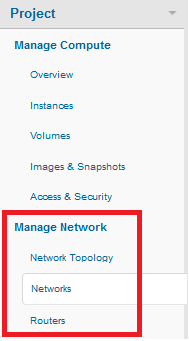

# How To's with HP Cloud Networking version 13.5

<!-- Modeled after How To's with the Compute Service (https://docs.hpcloud.com/compute/using/) Some text from network guide. -->

You might need to modify the default network or create additional networks.  This page gives you some how-to's to use the [Horizon Cloud Console](#console) or [HP Cloud CLI for Windows PowerShell](#powershell) to perform the following tasks:  

- Create a network
- Enable a network
- Disable a network
- Delete a network
- Rename a network
- Assign a router to a network
- Edit a sub-net
- Specify an IP address
- Rename a port
- Enable or disable a port

## Before you begin ## {#Overview}

If you have not previously created an account and activated the compute service please sign up at [http://hpcloud.com](http://hpcloud.com).  

Make sure you activate a compute instance in HP Cloud version 13.5 to access the networking and VPN capabilities.

## Using the Horizon Cloud Console ## {#console}

You can use the Horizon Cloud Console to perform the following tasks:

- [Create a network](#Creating)
- [Delete a network](#Deleting)
- [Enable or disable a network](#Enabling)
- [Connect a network to the router](#ConnectRouter)
- [Disconnect a network from the router](#DisconnectRouter)
- [Enable or disable a port](#Disableport)
- [Rename a network object](#RenameNet)

All of the procedures in this section require that you access the Networks or Routers tab in the Project section of the Horizon Cloud Console, <a name="NetworkTab">as shown</a>:
    

### How to create a network ### {#Creating}

To create a network and subnet, use the following steps:

1. Login to the [HP Public Cloud Console](https://horizon.hpcloud.com/).

2. Select the [Networks tab](#NetworkTab) under the Project section.

3. Click **Create Network**. 
	 

4. On the **Network** tab, enter a name for the network  and leave the **Admin State** selected.  
	 

5. Click **Next** to configure a subnet for the network. 

6. On the **Subnet** tab, enter the subnet name
	 

7. In the **Network Address** field enter a network address range for the subnet in Classless Inter-Domain Routing (CIDR) format, for example: 192.168.0.0/24.

8. In the **IP Version** field, select IPv4 or IPv6, as appropriate.

9. Leave the **Gateway IP** field blank to use the default value for the gateway IP address; for example, 192.168.0.1 for 192.168.0.0/24.

10. To disable the network gateway for this network, select  **Disable Gateway**. You will not be able to connect this network to the router if the gateway is disabled. 

11. Click **Next**. 

11. On the **Subnet Details** tab, DHCP is enabled by default. If you do not want to use the DCHP server on this subnet, clear the **Enable DHCP** option.
	 

12. To create an allocation pool, enter the starting and ending IP addresses you want for your subnet in the text entry fields, in the format IP_ADDR,IP_ADDR. For example: `192.168.1.10,192.168.1.120`.  

13. To create a DNS Nameserver, enter the `IP Address` you want for your subnet in the text entry field.

14. To create host routes, enter the `Destination CIDR` and `Next Hop` you want for your subnet in the text entry fields.  

15. Click **Create**. 

### How to delete a network ### {#Deleting}

You can delete a network, as needed. Before deleting a network, you must [disable any network ports](#EnablePort) and [delete any interface to the router](#DisconnectRouter).

1. Login to the [Horizon Console](https://horizon.hpcloud.com/).

2. Select the [Networks tab](#NetworkTab) under the Project section.

3. On the Networks screen, locate the network which you want to delete.

4. In the Actions column, click **More** -> **Delete Network** for your the network. 
	 

5. In the confirmation dialog, click **Delete Network**.

## How to enable or disable a network {#Enabling}

By default, when you [create a network](/mc/compute/networks/create-network#Creating), that network is created in an enabled admin state.  

You can to disable a port or enable a port as follows:

1. Login to the [Horizon Console](https://horizon.hpcloud.com/).

2. Select the [Networks tab](#NetworkTab) under the Project section.

3. On the Networks screen, locate the network which you want to enable.

4. In the Actions column, click **Edit Network** for your the network. 

5. In the Edit Network screen:
	- select the **Admin State** option to enable the network
	- clear the **Admin State** option to disable the network
	 

### How to connect a network to the router ### {#ConnectRouter}

A network connects to the router through an *interface*. 

You connect the router to a network or disconnect from a network as follows:

1. Login to the [Horizon Console](https://horizon.hpcloud.com/).

2. Select the [Routers tab](#NetworkTab) under the Project section.

3. On the Routers screen, click the name of the router.

4. On the Router Overview screen, click **Add Interface**.

5. In the **Subnet** field, select the network to connect.

6. Optionally, enter an IP address for the interface from the subnet IP address pool. If you do not specify an address, an address will be assigned from the pool.

7. Click **Add Interface**.

### How to disconnect a network from the router ### {#DisconnectRouter}

A network connects to the router through an *interface*. 

You disconnect a network as follows:

1. Login to the [Horizon Console](https://horizon.hpcloud.com/).

2. Select the [Routers tab](#NetworkTab) under the Project section.

3. On the Routers screen, click the name of the router.

4. On the Router Overview screen, locate the interface to the network you want to disconnect and click **Delete Interface**.

5. In the confirmation dialog, click **Delete Interface**.

### How to enable or disable a port ### {#EnablePort}

When a port is created, it is enabled by default. You can to disable a port or enable a port, as needed.

To enable or disable a port: 

1. Login to the [Horizon Console](https://horizon.hpcloud.com/).

2. Select the [Networks tab](#NetworkTab) under the Project section.

3. On the Networks screen, click the network associated with the port you want to rename.

4. In the Actions column, click **Edit Port** for your the port you are changing. 

5. In the Edit Port screen:
	- select **Admin State** to enable the port
	- clear **Admin State** to disable the port

	 

6. Click **Save Changes**.

### How to rename objects ### {#RenameNet}

You can change the name of many of the items on the Network screens, as follows:

1. Login to the [Horizon Console](https://horizon.hpcloud.com/).

2. Select the [Networks tab](#NetworkTab) under the Project section.

3. Locate the object which you want to rename.

4. In the Actions column, click the Edit button for the object. 

5. In the edit screen, if the name field is available, enter a new name and click the save button. If the name field is not available, you cannot change the name. 
	

## Using the Windows PowerShell ## {#powershell}

The HP Cloud environment command-line interface (CLI) software for Windows PowerShell allows Windows users to manage their HP Cloud services from the command line.

For the full reference of supported HP Cloud CLI commands for Windows PowerShell, see [HP Cloud Environment CLI Software for Windows PowerShell Command Line Reference](docs.hpcloud.com/cli/windows/2/reference/). 

### How to delete a network ### {#DeleteCLI}

1. On the 13.5 instance, launch a Windows PowerShell window.  

	Select the shell appropriate to your system, either the 64-bit or 32-bit version. 

2. Enter the HP Cloud environment CLI by entering:

	`PS C:> cd HPCS:`

3. Create a new network by executing the following command, using the appropriate values:
	
	remove-network

	remove-network -id -all

	Where
	
		id - The ID of the network to delete.

		all - Removes all networks in the current availability-zone associated with your project.

	The following example deletes a network with the specified ID

		remove-network -id 12857174-99cf-40e9-999e-fb0fa2e84898  

Deletes the Network with the id of 12857174-99cf-40e9-999e-fb0fa2e84898

### How to rename a network ### {#RenameNetCLI}

You can change the name of a network, as needed.

1. On the 13.5 instance, launch a Windows PowerShell window.  

	Select the shell appropriate to your system, either the 64-bit or 32-bit version. 

2. Enter the HP Cloud environment CLI by entering:

	`PS C:> cd HPCS:`

3. Change the network name by executing the following command, using the appropriate values:
	
	update-network -id networkIP Identity -n Name

	Where

	id - The network ID.

	n - The new name for the network.

	The following example renames the specified network to Network1:

		update-Network -id 12857174-99cf-40e9-999e-fb0fa2e84898 -n "Network1" 

### How to edit a sub-net### {#EditSubCLI}

You can modify a sub-net to rename the sub-net or change the the external gateway assigned to the sub-net.

1. On the 13.5 instance, launch a Windows PowerShell window.  

	Select the shell appropriate to your system, either the 64-bit or 32-bit version. 

2. Enter the HP Cloud environment CLI by entering:

	`PS C:> cd HPCS:`

3. Modify the sub-net by executing the following command, using the appropriate values:
	
	update-subnet -id SubnetIdentifier -egw ExternalGatewayNetworkIPAddress - n Name

	Where

		id - The sub-net ID.

		egw - The external gateway network ID to assign.

		n - The new name for the sub-net.

	The following example reassigns the subnet to the designated external network and renames the sub-net to "NewSubnetName":

	update-Subnet -id 12857174-99cf-40e9-999e-fb0fa2e84898 -egw 129.15.124.12 -n "NewSubnetName" 

### How to rename a port### {#RenamePortCLI}

By default, when a port is created, the port is automatically assigned a name and ID. For example, when you create a subnet, a port is created for that subnet. 

You can change the name of a port, as needed.

1. On the 13.5 instance, launch a Windows PowerShell window.  

	Select the shell appropriate to your system, either the 64-bit or 32-bit version. 

2. Enter the HP Cloud environment CLI by entering:

	`PS C:> cd HPCS:`

3. Change the port name by executing the following command, using the appropriate values:
	
	update-port  -id port -did name

	Where

	id - The port ID.

	did - The new name for the port.

	The following example renames the specified port to port1:

	update-Port -id 12857174-99cf-40e9-999e-fb0fa2e84898 -did "port1" 

### How to assign a router to a network ### {#AssignRouterCLI}

You can assign a router to an external network, as needed.

1. On the 13.5 instance, launch a Windows PowerShell window.  

	Select the shell appropriate to your system, either the 64-bit or 32-bit version. 

2. Enter the HP Cloud environment CLI by entering:

	`PS C:> cd HPCS:`

3. Assign the external network by executing the following command, using the appropriate values:
	
	update-router  -id RouterID -nid Name

	Where

	id - The router ID.

	nid - The new name for the router.

	The following example renames the specified router to router1:

	update-Port -id 12857174-99cf-40e9-999e-fb0fa2e84898 -nid "router1" 

##For further information## {#ForFurtherInformation}

* For information about the router details screen, take a look at the [Viewing router details](/mc/compute/networks/view-router/) page
For the full reference of supported HP Cloud CLI commands for Windows PowerShell, see [HP Cloud Environment CLI Software for Windows PowerShell Command Line Reference](docs.hpcloud.com/cli/windows/2/reference/)
* For basic information about our HP Cloud compute services, take a look at the [HP Cloud compute overview](/compute/) page
* Use the MC [site map](/mc/sitemap) for a full list of all available MC documentation pages
* For information about the Open Stack networking features, surf on over to [their networking wiki](https://wiki.openstack.org/wiki/Quantum)