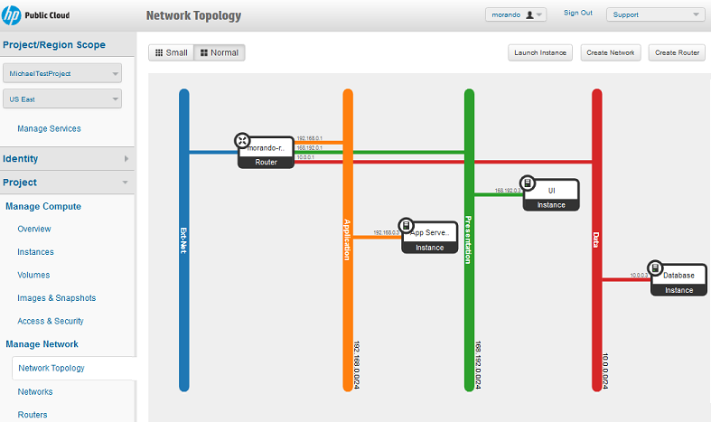

# HP Cloud Networking

HP Cloud Networking is a virtual networking service that provides network connectivity and addressing for HP Cloud compute devices. It is based on OpenStack Networking open source software. 

A default configuration comes with HP Cloud compute activation that includes a network, subnet,and  router connecting the subnets to the Internet.

You can use the default network to deploy HP Cloud compute virtual servers, or modify the default network to expand networking capabilities, including:

* Defining and configuring virtual networks
* Specifying IP subnets for those networks

## HP Public Cloud Console ##

You can use the HP Public Cloud Console to access HP Public Cloud Networking. 

You can view a visual depiction of your network in the console. From the Network Topology screen, you can access information about any aspect of your network and configure the network, as needed. 

 

## API ##
 
You can use a low level, raw REST API to access HP Public Cloud Networking. For more information on using the HP Cloud Networking API, see [HP Cloud Networking API Specifications](https://docs.hpcloud.com/api/v13/networking).

## CLI ##

You can use any of several command-line interface software to access HP Cloud compute. For more information on using the HP Cloud Networking API, see [HP Cloud CLI](http://docs.hpcloud.com/cli/).

## For further information

Check out the following pages for more information on using HP Cloud Networking services:

- [HP Public Cloud Networking: Quick Start Guide](/compute/network-quick-start/)
- [Getting Started with Networking 13.5](/compute.networking.getting-started)
- [HP Cloud Networking Overview](/networking/)
- [Known Issues and Best Practices in Compute and Networking in 13.5](https://community.hpcloud.com/article/known-issues-and-best-practices-compute-and-networking-135)
- [OpenStack networking wiki](https://wiki.openstack.org/wiki/Quantum)
