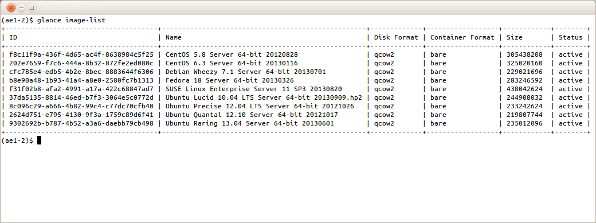
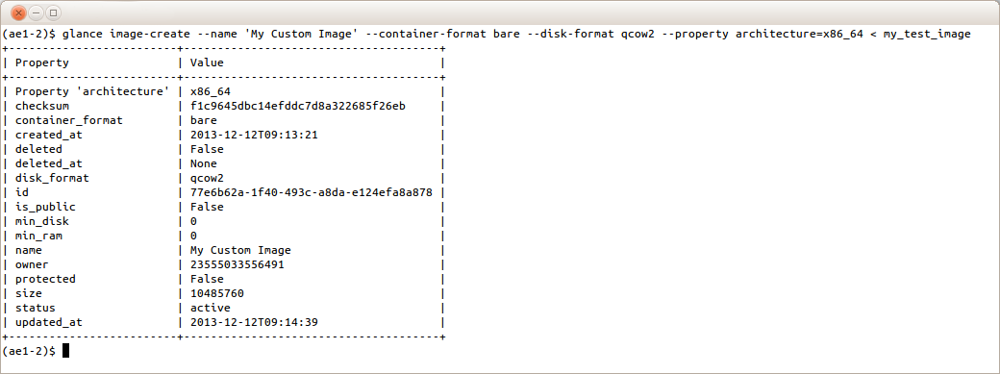
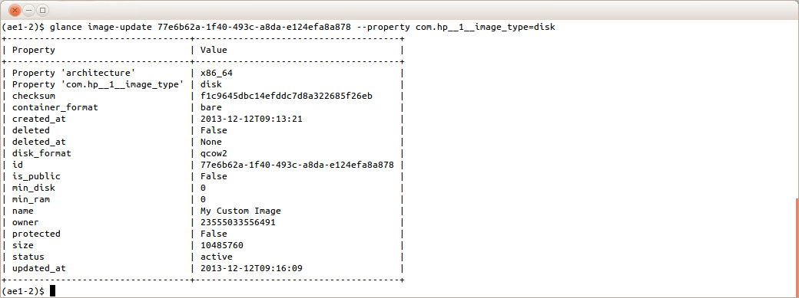
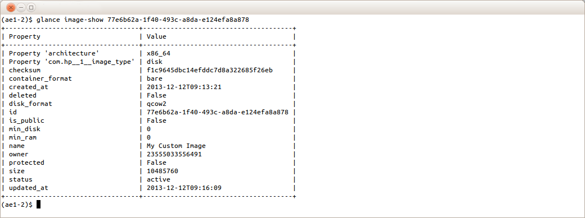
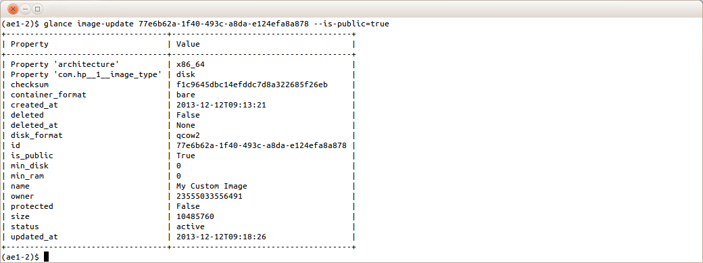
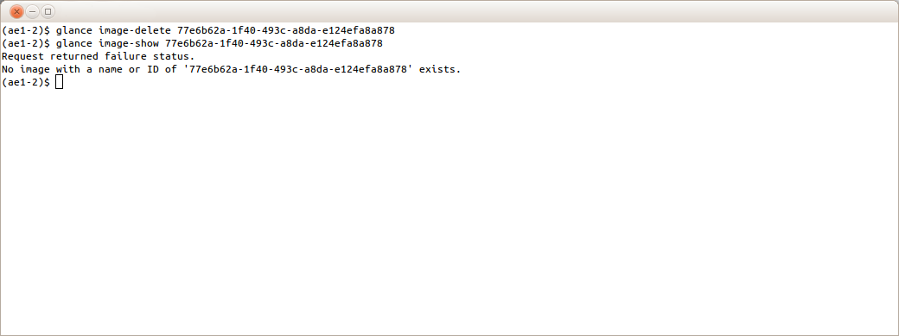

---
layout: default
title: "HP Cloud 13.5: Uploading and Publishing Partner Images"
permalink: /upload-publish-partner-images135/
product: image


# HP Cloud 13.5: Uploading and Publishing Partner Images # {#publishPartnerImage}
This document describes how to use the HP Cloud Image API to upload images and make them available for public use in HP Cloud 13.5. It is not intended to be an exhaustive description of the Glance client. See the [HP Cloud API documentation](https://docs.hpcloud.com/api/compute/) for complete details.

**Note:** As an image owner, it is your responsibility to ensure you have rights to use any software included in the image. HP is not responsible or liable for any unauthorized use of software by the owner of an image.

**Important:** Image upload and publicize is supported in the following regions:

* West 13.5 region-a.geo-1
* East 13.5 region-b.geo-1

All other regions are not supported.

### Why upload and publish ### {#publishImageReason}
HP Cloud offers you several public images for use; however, we might not have the exact image you require. With that in mind, HP Cloud allows you to upload and publicize your own images. For example, you might want a version of a Linux distribution that we do not currently offer. Or, you might want to create a customized ‘golden’ master image to import into HP Cloud. Whatever the scenario, if you require some customization we do not currently offer, uploading and publishing your own image is ideal for you!

### Image types ### {#publishImageTypes}
You can upload either public or private images with HP Cloud. Anyone can see and use a public image. If you upload a private image, it is only visible to you and will be in your image catalog.

We have two types of public images:

* Public images created by HP Cloud
* Partner images created by partners and made publicly available

All HP Cloud users have access to both types of public images. When you create a server in the HP Cloud classic management console, image options are grouped as follows:

* Public images
* Partner images
* Private images
* Bootable volumes

This document explains how to publish images to the **Partner Images** group by:

* [Reviewing getting started information](#publishGetStarted)
* [Creating a Windows image from a snapshot](#publishWindowsSnap)
* [Managing images using the Openstack Glance client](#publishManageGlance)
* [Managing images using curl commands](#publishManageCurl)

## Getting started ## {#publishGetStarted}
Before you upload and publish an image, you should read and understand the:

* [requirements for your images](#publishImageReqs)
* [upload and publish process](#publishImageOverview)

### Image requirements ### {#publishImageReqs}
**NOTE:** Note that documentation is required for all public images.

Your uploaded images must adhere to the following:

* Images for any licensed OS require a valid OS license.
* If you build your own image of a licensed OS, you must ensure a valid license is provided to users of that image.
* If you use an HP Cloud supplied licensed OS to create your own image from a snapshot, then the HP Cloud provided license is included.
* If you make any third party software programs available through your image, you shall comply with all third party license requirements for such use. HP does not control and is not responsible for any of these programs or their content. If you are required to agree to terms and conditions set by a third party for use of such third party software programs, you are responsible for compliance with these requirements. 

#### Common requirements #### {#publishCommonReqs}
You must ensure that all uploaded images meet the following requirements:

* An image must 
    * have `architecture` property set to either x86_64 or i686.
    * have [supporting documentation](#publishDocReqs).
    * support the VirtIO disk driver and network driver.
    * be configured to use DHCP for its primary network interface.
    * not have a MAC address tied to its primary network interface; an instance booted in the HP Cloud gets a random MAC address assigned by the HP Cloud infrastructure.
    * be self-contained; it should not be a multi-part image, e.g., one that references a separate ramdisk/kernel.
* Images should
    * be in `qcow2` format
    * support the x86_64 architecture; the i686 architecture is also supported by the HP Cloud but not as efficiently.

#### Linux requirements #### {#publishLinuxReqs}
Additionally, any Linux image:

* Must support an SSH server.
* Should support the cloud-init package for instance customization.

#### Windows requirements #### {#publishWindowsReqs}
All Windows images must support Remote Desktop Protocol.

#### Public image documentation requirements #### {#publishDocReqs}
Since documentation is required for all public images, you must provide a Knowledge Base document describing the intended use of the image, and:

* Steps to create an instance on HP Cloud using your image (bonus points for examples not using Management Console). 
* Contact information for access to non-HP Cloud support channels (e.g., web URL, phone number, email address, etc.). 

You can [contact HP Support](https://www.hpcloud.com/contact_us) or email this documentation to support@hpcloud.com. Be sure to include the image name and ID, if available. 

If you intend to use your public image outside of the HP Cloud environment (e.g., the partner/customer application makes API calls to HP Cloud to bring up the instance), your documentation requirements do not have to be as detailed. Rather, a simple Knowledge Base document that includes what the image does and where to go for support might be sufficient. 

You can find partner-provided examples of the required documentation on the following pages:

* [HP Cloud Stackato documentation](http://docs.stackato.com/server/hpcs.html)
* [Setting up Stackato on HP Cloud](https://community.hpcloud.com/article/how-do-i-set-stackato-hp-cloud-services) 

### Upload/publish overview ### {#publishImageOverview}
Image upload refers to the uploading of a virtual machine image into HP Cloud. A new image is created in HP Cloud with the supplied image data and associated metadata.

**Important:** Images are region specific; an image is only available in the region it has been uploaded to. If the image is needed in multiple regions it needs to be created in each region.

Making an image public refers to setting the `is_public` metadata of an image which exists in HP Cloud to `True`. Once set, the image becomes a public image. Public images:

* Are visible when users list images
* Can be used by all users to create new virtual machine instances in the region

**Note:** An image whose `is_public` metadata field is `False` is referred to as a private image. Private images are only visible to their owner and can only be accessed by their owner.

To upload and publish an image, you must 

1. Install the OpenStack Glance command line tool (or an appropriate API interaction tool like curl).
2. Configure the tool to interact with the HP Cloud Image Service.
3. Create an image:
    * Create an acceptable image in your environment and upload it to HP Cloud
    * Create a snapshot image from a running instance in HP Cloud
4. Decide whether to make your image public.
5. Supply the required documentation if your image is to be made publicly available.

**Warning:** You should only publicize an image once it has been fully tested!

### Creating an image from a snapshot ### {#publishWindowsSnap}
One way to create an image is to customize an HP Cloud-provided licensed, public image. There are several ways you can do this; however, the steps below describe one method for customizing an HP Cloud-provided licensed image. For more detailed information or to see alternative methods, see the [Creating a snapshot of an Instance](https://community.hpcloud.com/article/creating-snapshot-instance) web page.

1. Boot an HP-provided instance and note the instance uuid.
2. Customize the instance by installing software, completing operating system customization, and any additional preperation steps you require.
3. Sysprep and shutdown the image as Administrator from the command prompt: 

    **Note:** Steps d and e only apply to Windows 2008 R2 SP1. For all other Windows flavors, skip these two steps.

    a. cd c:\windows\setup\hpcloud<br>
    b. sdelete -z c<br>
    c. startsysprep<br>
    d. FirstNetwork.reg<br>
    e. Shutdown the instance.

4. Verify that the instance is shut down:

    `nova image-show <instance uuid>`

5. Create the snapshot: 

    `nova image-create <instance uuid> <my snapshot name>`

    **Note:** Only the root partition is included with the snapshot; the ephemeral storage will be lost.

6. Delete the instance from which the snapshot was taken:

    `nova delete <instance uuid>`

7. Publish the snapshot.

## Required attributes and properties## {#publishReqAttsProps}
In general, you do not need to add additional image attributes or properties to your image in order to use it in HP Cloud with the Image API; however, certain image attributes and properties must be defined for the image to either be **deployed on HP Cloud** or **displayed in the HP Cloud management console**. 

### Deploying images on HP Cloud ### {publishReqsDeploy}
To be deployed on HP Cloud, the following attributes and properties must be defined/set for an image when it is created: 

**Attributes**

* container-format = `bare`
* disk-format = `qcow2`
* name = approximately 72 ASCII characters

**Property**

* architecture = `x86_64` or `i686`<br>
    This property is used by Nova to spin up instances and must be set to either x86_64 or i686.

### Displaying images in HP Cloud management console ### {publishReqsDisplay}
The HP Cloud management console uses custom properties to categorize and display an image. If you want to use the management console, the following custom properties must be set to control how the image is categorized and displayed. 

<table>
  <thead>
    <tr>
      <th>Property</th>
      <th>Supported Values</th>
      <th>Usage</th>
    </tr>
  </thead>
  <tbody>
   
      <td>com.hp__1__image_type</td>
      <td><ul><li>disk</li>
      <li>kernel</li>
      <li>ramdisk</li>
      <li>machine</li>
      </ul></td>
      <td><ul><li>Filters out non-bootable images from image catalog</li>
      <li>Only images with property set to <code>disk</code> or <code>machine</code> display in image catalog</li>
      <li><code>disk</code> is used for single-part qcow2 images</li>
      <li><code>kernel</code>, <code>ramdisk</code>, <code>machine</code> are used for multi-part images</li></ul></td>      
    </tr>
    <tr>
      <td>com.hp__1__image_lifecycle</td>
      <td><ul><li>active</li>
      <li>deprecated</li>
      </ul></td>
      <td><ul><li>Filters out old images from image catalog</li>
      <li>Only images with property set to <code>active</code> display in image catalog</li>
      <li>Intended to only show latest (active) image of a given distribution</li></ul></td>
    </tr>
    <tr>
      <td>com.hp__1__bootable_volume</td>
      <td><ul><li>true</li>
      <li>false</li>
      </ul></td>
      <td><ul><li>Filters out images that are not compatible with bootable volume</li>
      <li>Only images with property set to <code>true</code> can be used to create a bootable volume</li></ul></td>
    </tr>
    <tr>
      <td>com.hp__1__os_distro</td>
      <td>Reverse URL of image's OS distribution</td>
      <td><ul><li>Example values: <code>com.ubuntu</code>, <code>org.debian</code>, or <code>com.microsoft.server</code></li>
      <li>Groups images into Linux and Windows categories</li>
      <li>Property must be set to <code>com.microsoft.server</code> for Windows images to properly show up in Windows image catalog</li></ul></td>
    </tr>
  </tbody>
</table>

See the [Glance client](#publishGlanceCreate) and [curl](#publishCurlUpload) sections for the steps to set these attributes and properties.

## Managing images using Openstack Glance client ## {#publishManageGlance}
In this section, you will learn the basic commands used in the Glance client for managing your images. However, before using the Glance client, you must set several variables for your environment. After your variables are set, the rest of this section will show you how to:

* Install the python-glanceclient
* List images
* Upload images
* Define image attributes
* Set image properties
* Show image details
* Make an image public
* Delete an image
* Deprecate an image

There is also a section on the most common HTTP errors you that might occur. 

**Important:** For more information on using the Glance client tool see [Openstack's documentation](http://docs.openstack.org/trunk/openstack-image-service/admin/content/using-the-glance-cli-tool.html).

### Configuring environment variables ### {#publishConfigEnv}
**Important:** Before using the Glance client, ensure you have followed these steps to set your environment variables.

To interact with HP Cloud Image API endpoint the following environment variables should be set appropriately:

<ul>
<li>OS_USERNAME</li>
<li>OS_PASSWORD</li>
<li>OS_TENANT_NAME</li>
<li>OS_AUTH_URL</li>
<li>OS_AUTH_STRATEGY</li>
<li>OS_REGION_NAME</li>
</ul>

**Note:** If you are using curl rather than the Glance client, the "OS_IMAGE_URL" is also required.

To configure your environment variables using bash, complete the following steps.

**Note:** You can complete these steps in any shell; however, the commands will be different.

1. Open a bash command window and navigate to the directory where you want to keep the variables.
2. Run the following command to create a text file to store the variables, where `.glancerc` is your file name:

    `$ touch .glancerc`
3. Change permissions on the file so that only you can read and write to it:

    `$ chmod 600 .glancerc`
4. Open you editor of choice, such as vi:

    `$ vi .glancerc`
5. Add the required variables and their values, such as the following, where your management console user name is `me@example.com` and password is `Pa$$w0rd`:

    ```
    # Account specific  
    export OS_USERNAME=me@example.com  
    export OS_TENANT_NAME=me@example.com  
    export OS_PASSWORD=Pa$$w0rd  
    # Not-account specific (same for all users)  
    export OS_AUTH_URL=https://region-b.geo-1.identity.hpcloudsvc.com:35357/v2.0  
    export OS_AUTH_STRATEGY=keystone  
    export OS_REGION_NAME=region-b.geo-1  
    # Note: If using 'curl' add "OS_IMAGE_URL"  
    export OS_IMAGE_URL=https://region-b.geo-1.images.hpcloudsvc.com:443
    ```


6. Save your changes and exit the editor.
7. Establish the environment:

    `$ source .glancerc`

### Installing Glance client tool ### {#publishInstallGlance}
The `glance` command is provided with OpenStack’s Glance client tool. Refer to [Openstack's documentation](http://docs.openstack.org/user-guide/content/install_clients.html) or [Cloud 13.5 CLI Installation Instructions](https://community.hpcloud.com/article/cloud-135-cli-installation-instructions) for information on installing the Glance client tool.

If the Glance client is not available for your platform see the instructions below for [installing and using curl](#publishManageCurl).

### Listing images ### {#publishGlanceList}
Once you have configured your environment variables and installed the Glance client tool, you are ready to interact with your images using the glance command.

To see a list of available images:

1. Open your choice of command shell.
2. Run the following command at the prompt to see a list of images:

    `$ glance image-list`

    

### Uploading an image ### {#publishGlanceCreate}
When you upload your image, you must [define/set the required attributes and property](#publishReqsDeploy).

**Note:** The `architecture` property you set and the attributes you define, allow you to upload and boot your image. If you want to use the HP Cloud management console, you must [set additional properties](#publishReqsDisplay).

To upload your new image using the Glance `image-create` command:

1. Open your choice of command shell.
2. Run the following command to upload your new image and define/set the required attributes and property, where your image name is `My Custom Image` and your image file location is `/root/images/my_test_image.qcow2`:

    ```
    $ glance image-create --name 'My Custom Image' --container-format bare --disk-format qcow2 --property architecture=x86_64 < /root/images/my_test_image.qcow2
    ```

    **Note:** You can define/set all [required](#publishReqsDeploy) and [optional](#publishReqsDisplay) attributes and properties in this step.

3. Verify that your image status is active.

    **Important:** Your image should have status 'active' when it has completed upload. 

    

4. Once the image status is `active`, you can boot it using the relevant nova commands or the HP Cloud web interface. See the documentation for [creating instances](https://community.hpcloud.com/article/creating-your-first-instance) for more information.

**Important:** Image upload duration will vary depending on your internet service provider's bandwidth and on the image size. If you have a problem with your system timing out, you can upload the image to an instance running on HP Cloud 13.5, and then use the Glance client tool to upload the image to Glance. Newer Glance clients provide a `–progress` argument to monitor upload progress. If you need to monitor upload progress and your version of the Glance client does not support `–progress`, use the curl command documented below.

### Updating properties required for HP Cloud management console ### {#publishGlanceUpdate}
If you want your images to display in the HP Cloud management console, you must [set additional properties](#publishReqsDisplay). To set these required properties for an uploaded image, use the `--property` option of the `glance` command:

    $ glance image-update <image_name_or_id> --property <property_name>=<property_value>

For example, to set the `image type` property to `disk`, run the following command:

    $ glance image-update <image_name_or_id> --property com.hp__1__image_type=disk
<br>


You can run this command for each required property, or you can include all the required properties in one command, for example:

    $ glance image-update <image_name_or_id> --property com.hp__1__image_type=disk --property com.hp__1__image_lifecycle=active --property com.hp__1__bootable_volume=true --property com.hp__1__os_distro=org.debian

If you want to define additional attributes or set additional properties, follow the same syntax.

### Showing image details ### {#publishGlanceShow}
Image details can be displayed using the `image-show` option. To display image details, run the following command:

    $ glance image-show <image_name_or_id>
<br>


### Making an image public ### {#publishGlancePublic}
Images are not public by default. If you have privileges to make images public, you can publish your image. To do this, run the `glance image-update` command:

    $ glance image-update <image_name_or_id> --is-public=true
<br>


**REVIEW COMMENT FROM JH: more to it than simply adding --is-public=true; they should also clean up some of the snapshot image properties**

### Deleting an image ### {#publishGlanceDelete}
**Warning:** You should never delete an active public image without [contacting HP Support](https://www.hpcloud.com/contact_us) since there might be active virtual machines using that image.

If you no longer want your image, use the Glance `image-delete` command to remove it. To delete an image:

1. Type the following command: 

    `$ glance image-delete <image_name_or_id>`

2. Type the following command to verify your image was deleted:

    `$ glance image-show <image_name_or_id>`

    

### Deprecating an image ### {#publishGlanceDeprecate}
**Warning:** you should never deprecate an active public image without [contacting HP Support](https://www.hpcloud.com/contact_us) since there might be active virtual machines using that image.

As long as an image exists in HP Cloud, it will appear in all image listings using the HP Cloud Image API (using curl or the Glance client). You can exclude an image from the HP Cloud management console by setting the `com.hp__1__image_lifecycle` property to `deprecated`. This will effectively deprecate the image for use by users of the management console.

To deprecate an image in HP Cloud management console:

    $ glance image-update <image_name_or_id> --property com.hp__1__image_lifecycle=deprecated

See the Openstack documentation for more information on [managing your images using the Glance client](http://docs.openstack.org/user-guide/content/cli_manage_images.html).

### Common errors ### {#publishGlanceErrors}
Possible HTTP return codes are listed in HP Cloud Image API documentation[l27]. The most common errors (and possible explanations) are:

* HTTP 401: (unauthorized) you specified invalid credentials
* HTTP 403: (forbidden) you are not activated for HP Cloud Compute Service
* HTTP 404: (not found) you incorrectly specified the image id

## Managing images using curl ## {#publishManageCurl}
The preferred method for interacting with the HP Cloud Image API is by using glance command in the Glance client tool. If that command is not available for your platform, you can manage your images using the `curl` command.

**Important:** Before using curl, ensure that you have [configured environment variables](#publishConfigEnv) for your system.

### Acquiring a token ### {#publishCurlToken}
Before you can manage your images using curl, you must acquire a token using your credentials. To acquire a token:

1. Run the following command:

    ```
    $ curl -XPOST -H "Content-Type: application/json" -d"{\"auth\":{\"tenantName\": \"$OS_TENANT_NAME\", \"passwordCredentials\": {\"username\": \"$OS_USERNAME\", \"password\": \"$OS_PASSWORD\"}}}" $OS_AUTH_URL/tokens
    ```

**Important:** Be careful using the double quotes (") and escaped double quotes (\") in the command above.

The curl command should return output, such as:

    {"access": {  
      "token": {  
        "expires": "2013-05-24T22:03:30.036Z",   
        "id": "HPAuth10_a73d39f83b98359a7a0951f51a393aaeafdc00fcbcd31c300384917",  
        "tenant": {  
           "id": "12345678",   
           "name": "jane.smith@example.com"  
           }  
        },
    .  
    .  
    .

2. Copy the token ID to the system clipboard. For example, in the output above the token ID is:

    `HPAuth10_a73d39f83b98359a7a0951f51a393aaeafdc00fcbcd31c300384917`

3. To perform Glance API operations using curl, you must export the token. To export the token, run the  `export` command using the generated token ID, such as:

    `$ export TOKEN_ID=HPAuth10_a73d39f83b98359a7a0951f51a393aaeafdc00fcbcd31c300384917`

### Listing images ### {#publishCurlList}
To see a list of available images, type the following command, where `OS_IMAGE_URL/v1.0/images` is the location of your images:

    `$ curl -H "X-Auth-Token: $TOKEN_ID" $OS_IMAGE_URL/v1.0/images`

Your output should be similar to this:

    ```
    {"images": [{"name": "CentOS 6.3 Server 64-bit  
    20130116 (b)", "container_format": "bare",   
    "disk_format": "qcow2", "checksum":   
    "b43071530a6a1704b5b8b644a6f5231e", "id":   
    "2ffc3a4c-8272-478f-a5a8-0067c0012e33", "size":   
    325020160}, {"name": "CentOS 5.8 Server 64-bit   
    20120828 (b)", "container_format": "bare",   
    "disk_format": "qcow2", "checksum":   
    "e66bad1137c6d519fc5c6fb175e45b71", "id":   
    "fcc0edba-6f1b-4451-a4cc-7c63f20430b5", "size":   
    305438208}]}
    ```

    **Note:** This command will list up to 1000 images.
<!--
2. (Optionally) If you have more than 1000 images available, add the last image id to the command as a marker to list more images, where the last image ID is fcc0edba-6f1b-4451-a4cc-7c63f20430b5:

    `$ curl -H "X-Auth-Token: $TOKEN_ID" $OS_IMAGE_URL/v1.0/images?marker=fcc0edba-6f1b-4451-a4cc-7c63f20430b5`
-->
### Uploading an image ### {#publishCurlUpload}
**Important:** You must supply `"X-Image-Meta-Container_format"` and `"X-Image-Meta-Disk_format"` headers.

When you upload your image, you must define the [required attributes](#publishReqsDeploy). To upload your image, complete the following steps:

1. Run the following command where `/tmp/image.qcow2` is the location and name of your image file, where `My Custom Image` is the name of your image and `tmp/image.qcow2` is the location and file name of your image:

    ```
    $ curl -XPOST -H "X-Auth-Token: $TOKEN_ID" -H "Content-Type: application/octet-stream" -H "X-Image-Meta-Disk_format: qcow2" -H "X-Image-Meta-Container_format: bare" -H "X-Image-Meta-Name: My Custom Image" --data-binary @/tmp/image.qcow2 --progress-bar $OS_IMAGE_URL/v1.0/images -o /tmp/out
    ```

2. Run the following command to verify your image was uploaded:

    `$ cat /tmp/out`

    Your output should be similar to this:

    ```
    {"image": {"status": "active", "name": "My Custom Image", "deleted": false, "container_format": "bare", "created_at": "2013-05-24T11:44:48", "disk_format": "qcow2", "updated_at": "2013-05-24T11:44:49", "id": "8d1ba046-b06e-425d-b867-7b8c960ddaaa", "min_disk": 0, "protected": false, "min_ram": 0, "checksum": "fcb3450fb99fd160f6567df398921aed", "owner": "123456", "is_public": false, "deleted_at": null, "properties": {}, "size": 456}}
    ```

**Important:** When the upload is complete, your image status is `active`, and you can boot it using the relevant nova commands or the HP Cloud web interface. See the documentation for [creating instances](https://community.hpcloud.com/article/creating-your-first-instance) for more information.

### Setting properties required for HP Cloud management console ### {#publishCurlProps}
To [set the required properties](#publishReqsDisplay) to display your image in the HP Cloud management console, run the following command:

    curl -v -XPUT -H "X-Auth-Token: $TOKEN_ID"  -H 'X-Image-Meta-Property-<property_name>: <property_value>' $OS_IMAGE_URL/v1.0/images/<image_id>

For example, if you set the property `com.hp__1__image_type` to `disk`:

    curl -v -XPUT -H "X-Auth-Token: $TOKEN_ID"  -H 'X-Image-Meta-Property-com.hp__1__image_type: disk' $OS_IMAGE_URL/v1.0/images/<image_id>

Run this command for each required property substituting the property name and value. If you want to set additional custom properties, follow the same syntax.

### Showing image details ### {#publishCurlShow}
To show information about an image, run the following command:

    $ curl -v -XHEAD -H "X-Auth-Token: $TOKEN_ID" $OS_IMAGE_URL/v1.0/images/<image_id>

### Making an image public ### {#publishCurlPublic}
To make an image public, run the following command:

    $ curl -v -XPUT -H "X-Auth-Token: $TOKEN_ID" -H 'X-Image-Meta-Is_public: True' -H 'X-glance-registry-Purge-props: False' $OS_IMAGE_URL/v1.0/images/<image_id>

**Important:** To avoid removal of existing custom properties, you must include X-glance-registry-Purge-props: False.

### Deleting an image ### {#publishCurlDelete}
To delete an image, run the following:

    curl -v -XDELETE -H "X-Auth-Token: $TOKEN_ID"   $OS_IMAGE_URL/v1.0/images/<image ID>

### Deprecating an image ### {#publishCurlDeprecate}
To deprecate an image, run the following:

    curl -v -XPUT -H "X-Auth-Token: $TOKEN_ID"  -H 'X-Image-Meta-Property-com.hp__1__image_lifecycle: deprecated' $OS_IMAGE_URL/v1.0/images/<image ID>

## For further information ## {#MoreInfo}

For more information on migration, as well as general information about version 13.5:

* [HP Cloud API documentation](https://docs.hpcloud.com/api/compute/)
* [Openstack's documentation](http://docs.openstack.org/user-guide/content/install_clients.html)
* [Cloud 13.5 CLI Installation Instructions](https://community.hpcloud.com/article/cloud-135-cli-installation-instructions)
* [Technical support knowledge base](https://community.hpcloud.com)

## Contacting support ##
If you need further assistance, you can contact support in any of these ways:

* [Live chat from hpcloud.com](https://account.hpcloud.com/cases#support_chat)
* [Open a support case](https://account.hpcloud.com/cases)
* [Email support@hpcloud.com](mailto:support@hpcloud.com)
* Call at 1-855-61CLOUD (1-855-612-5683) in the U.S. or +1-678-745-9010 internationally.

