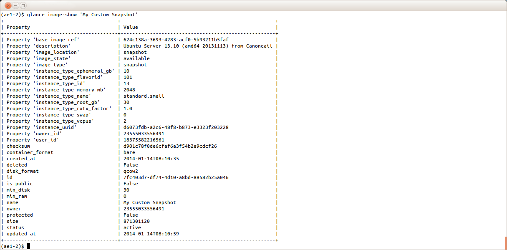
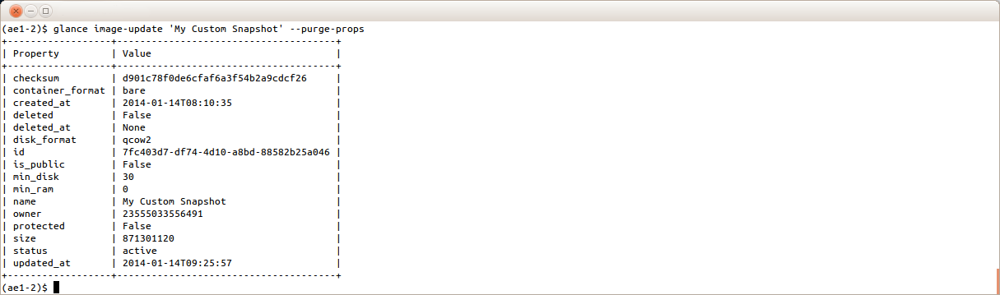

# HP Cloud 13.5: How to Upload a Partner Image and Make it Public # {#publishPartnerImage}
This document describes how to use the HP Cloud Image API to upload images and make them available for public use in HP Cloud 13.5. It is not intended to be an exhaustive description of [managing images using the Glance client](http://docs.openstack.org/user-guide-admin/content/cli_manage_images.html). For additional detail, see the [glance command reference](http://docs.openstack.org/user-guide-admin/content/glanceclient_commands.html) and the [HP Cloud Image Service API specification](https://docs.hpcloud.com/api/v13/image/).

**Note:** As an image owner, it is your responsibility to ensure you have rights to use any software included in the image. HP is not responsible or liable for any unauthorized use of software by the owner of an image.

**Important:** The following regions support uploading an image and making it publicly available:

* Region A West 13.5 (region-a.geo-1)
* Region B East 13.5 (region-b.geo-1)

All other regions do not support the Image API.

### Why upload an image and make it public ### {#publishImageReason}
HP Cloud offers several public images for you to use; however, we might not have the exact image you require. With that in mind, HP Cloud allows you to upload your own images and make them publicly available. For example, you might want a version of a Linux distribution that we do not currently offer. Or, you might want to create a customized golden master image to import into HP Cloud. Whatever the scenario, if you require a specific customized, public image that we do not currently offer, uploading your own image and making it public is ideal for you!

### Image types ### {#publishImageTypes}
You can create either a public or private image to upload to HP Cloud. Anyone can see and use a public image. If you upload a private image, it is listed in your image catalog and only visible to you.

We have two types of public images:

* HP Cloud-created public images 
* Partner-created public images

All HP Cloud users have access to both types of public images. When you create a server, your image options are:

* Public images
* Partner images
* Private images
* Bootable volumes

This document explains how to upload images and make them public within the **Partner Images**, described in the following sections:

* [Getting started](#publishGetStarted)
* [Creating an image from a snapshot](#publishWindowsSnap)
* [Uploading and managing images](#publishManageGlance)

We also provide you with links to more information and ways to contact customer support:

* [Additional information](#MoreInfo)
* [Contacting customer support](#contactSupport)

## Getting started ## {#publishGetStarted}
Image upload refers to the uploading of a virtual machine image into HP Cloud, which creates a new image containing your image data and associated metadata.

**Important:** Images are region-specific; an image is only available in the region to which it has been uploaded. If you need an image in multiple regions, you must create it in each region.

Making an image public refers to setting the `is_public` metadata of an image which exists in HP Cloud to `True`. Once set, the image becomes a public image in the HP Cloud. Public images:

* Are visible when users list images.
* Can be used by all users to create new virtual machine instances in the region.

**Note:** An image whose `is_public` metadata field is `False` is referred to as a private image. Private images are only visible to and accessible by their owners.

In brief, to upload an image and make it public, you must 

1. Install the OpenStack Glance command line tool (or an appropriate API interaction tool like curl).
2. Configure the tool to interact with the HP Cloud Image Service.
3. Create an image by either:
    * Creating an acceptable image in your environment and uploading it to HP Cloud
    * Creating a snapshot image from a running instance in HP Cloud
4. Supply the required documentation if you intend to make your image public.

**Warning:** You should only make an image public after you have fully tested it!

Before you upload an image and make it public, you must:

* [Install tools](#toolsInstall)
* [Configure environment variables](#publishConfigEnv)
* [Acquire a token if using curl](#publishCurlToken)
* [Understand image requirements](#publishImageReqs)
* [Understand required attributes and properties](#publishReqAttsProps)

### Installing tools ### {#toolsInstall}
To interact with the HP Cloud Image API, you need to install the Nova and Glance client tools. If your platform does not support the Glance client, you can use the curl command.

#### The Nova and Glance client tools #### {#publishInstallGlance}
Openstack's Nova client tool provides API access to the Nova service. Openstack's Glance client tool provides the `glance` command, which is the preferred method for interacting with the HP Cloud Image API. Refer to [Openstack's documentation](http://docs.openstack.org/user-guide/content/install_clients.html) or [Cloud 13.5 CLI Installation Instructions](https://community.hpcloud.com/article/cloud-135-cli-installation-instructions) for information on installing the Nova and Glance client tools.

If the Glance client is not available for your platform, see the alternate instructions below for [installing curl](#installCurl).

#### The curl command #### {#installCurl}
The preferred method for interacting with the HP Cloud Image API is to use the `glance` command in the Glance client tool. If the `glance` command is not available for your platform, you can manage your images using the `curl` command.

**Important:** Before using curl, ensure that you have acquired a token and [configured environment variables](#publishConfigEnv) for your system.

### Configuring environment variables ### {#publishConfigEnv}
Before using the Glance client (or curl) to manage images, ensure you have followed these instructions to set your environment variables. To interact with HP Cloud Image API endpoint, appropriately set the following environment variables:

<ul>
<li>OS_USERNAME</li>
<li>OS_PASSWORD</li>
<li>OS_TENANT_NAME</li>
<li>OS_AUTH_URL</li>
<li>OS_AUTH_STRATEGY</li>
<li>OS_REGION_NAME

<b>Important:</b> The following regions support uploading an image and making it publicly available:

<ul><li>Region A West 13.5 (region-a.geo-1)</li>
<li>Region B East 13.5 (region-b.geo-1)</li>
</ul>

All other regions do not support the Image API.

</li>
<li>OS_IMAGE_URL

<b>Important:</b> If you are using curl, you must also set the image URL. Since the Glance client determines the image URL automatically, if it is set, you do not need this variable.

</li>
</ul>

To configure your environment variables using bash, complete the following steps.

**Note:** You can complete these steps in any shell; however, the commands will differ.

<ol>
<li>Open a bash command window and navigate to the directory where you want to keep the variables.</li>
<li>Run the following command to create a text file to store the variables, where <code>.glancerc</code> is your file name:

<pre>
    $ touch .glancerc</pre>
</li>
<li>Change permissions on the file so that only you can read and write to it:
<pre>
    $ chmod 600 .glancerc</pre>
</li>
<li>Open you editor of choice, such as vi:
<pre>
    $ vi .glancerc</pre>
</li>
<li>Add the required variables and their values, for example, where the management console user name is <code>me@example.com</code> and the password is <code>Pa$$w0rd</code>:

<pre>
    # Account specific
    export OS_USERNAME=me@example.com  
    export OS_TENANT_NAME=me@example.com  
    export OS_PASSWORD=Pa$$w0rd  
    # Not-account specific (same for all users)  
    export OS_AUTH_URL=https://region-b.geo-1.identity.hpcloudsvc.com:35357/v2.0  
    export OS_AUTH_STRATEGY=keystone  
    export OS_REGION_NAME=region-b.geo-1  
    # Note: If using 'curl' you must set "OS_IMAGE_URL"  
    export OS_IMAGE_URL=https://region-b.geo-1.images.hpcloudsvc.com:443
</pre>

</li>
</ul>
<li>Save your changes and exit the editor.</li>
<li>Establish the environment:
<pre>
    $ source .glancerc</pre>
</li>
</ol>

### Acquiring a token (curl) ### {#publishCurlToken}
Before you can manage your images using curl, you must acquire a token using your credentials. To acquire a token:

<ol><li>Run the following command:

<pre>
    $ curl -XPOST -H "Content-Type: application/json" -d"{\"auth\":{\"tenantName\": 
    \"$OS_TENANT_NAME\", \"passwordCredentials\": {\"username\": \"$OS_USERNAME\",
    \"password\": \"$OS_PASSWORD\"}}}" $OS_AUTH_URL/tokens
</pre>`

**Important:** Be careful using the double quotes (") and escaped double quotes (\") in the command above.

The curl command should return output, such as:

<pre>
    {"access": {  
      "token": {  
        "expires": "2013-05-24T22:03:30.036Z",   
        "id": "HPAuth10_a73d39f83b98359a7a0951f51a393aaeafdc00fcbcd31c300384917",  
        "tenant": {  
           "id": "12345678",   
           "name": "jane.smith@example.com"  
           }  
        },
    .  
    .  
    .
</pre>
</li>
<li> Copy the token ID to the system clipboard. For example, in the output above the token ID is:

<pre>HPAuth10_a73d39f83b98359a7a0951f51a393aaeafdc00fcbcd31c300384917
</pre>
</li>
<li> To perform Glance API operations using curl, you must export the token. To export the token, run the <code>export</code> command using the generated token ID. For example:

<pre>$ export TOKEN_ID=HPAuth10_a73d39f83b98359a7a0951f51a393aaeafdc00fcbcd31c300384917
</pre>
</li>
</ol>

### Image requirements ### {#publishImageReqs}
**NOTE:** We require documentation for all public images.

Your uploaded images must adhere to the following:

* Images for any licensed OS require a valid OS license.
    * If you build your own image of a licensed OS, you must ensure that you provide a valid license to image users.
    * If you use an HP Cloud supplied licensed OS to create your own image from a snapshot, then the HP Cloud provided license is included.
* If you make any third-party software programs available through your image, you must comply with all third-party license requirements for such use. HP does not control and is not responsible for any of these programs or their content. If you are required to agree to terms and conditions set by a third party for usage of such third-party software programs, you are responsible for compliance with these requirements. 

#### Common requirements #### {#publishCommonReqs}
You must ensure that all uploaded images meet the following requirements:

* An image must:
    * have the `architecture` property set to either x86_64 or i686.
    * have [supporting documentation](#publishDocReqs).
    * support the VirtIO disk driver and network driver.
    * be configured to use DHCP for its primary network interface.
    * not have a MAC address tied to its primary network interface; an instance booted in the HP Cloud gets a random MAC address assigned by the HP Cloud infrastructure.
    * be self-contained; it should not be a multi-part image, e.g., one that references a separate ramdisk/kernel.
* An image should:
    * be in the `qcow2` format
    * support the x86_64 architecture; the HP Cloud supports the i686 architecture, but it is not as efficient.

#### Linux requirements #### {#publishLinuxReqs}
Additionally, any Linux image:

* Must support an SSH server.
* Should support the cloud-init package for instance customization.

#### Windows requirements #### {#publishWindowsReqs}
All Windows images must support Remote Desktop Protocol.

#### Public image documentation requirements #### {#publishDocReqs}
Because we require  documentation for all public images, you must provide a Knowledge Base document describing the intended use of the image, and:

* Steps to create an instance on the HP Cloud using your image (we encourage examples not using Management Console). 
* Contact information for access to non-HP Cloud support channels, for example, web URL, phone number, email address, etc. 

You can [contact HP Support](https://www.hpcloud.com/contact_us) or email this documentation to support@hpcloud.com. Be sure to include the image name and ID, if available. 

If you intend to use your public image outside of the HP Cloud environment (for example, the partner/customer application makes API calls to HP Cloud to bring up the instance), your documentation requirements do not have to be as detailed. Rather, a simple Knowledge Base document that includes what the image does and where to go for support should be sufficient. 

You can find partner-provided examples of the required documentation on the following pages:

* [Setting up Stackato on HP Cloud](https://community.hpcloud.com/article/how-do-i-set-activestate-stackato-hp-cloud-services) 
* [Stackato HP Cloud documentation](http://docs.stackato.com/admin/server/hpcs.html)
* [CohesiveFT Partner Images](https://community.hpcloud.com/article/cohesiveft-partner-images-now-available)
* [CohesiveFT VNS3 3.x Configuration for HP Cloud](http://www.cohesiveft.com/dnld/CohesiveFT-VNS3-3.0.4_HPCS.pdf)

#### Required attributes and properties for images #### {#publishReqAttsProps}
In general, you do not need to add additional attributes or properties to your image in order to use it in HP Cloud with the Image API; however, you must define certain image attributes and properties for the image to either be **deployed on HP Cloud** or **displayed in the HP Cloud management console**. 

##### Deploying images in HP Cloud ##### {#publishReqsDeploy}
To deploy an image in HP Cloud, you must define/set the following attributes and properties when you create the image: 

**Attributes**

* container-format = `bare`
* disk-format = `qcow2`
* name = approximately 72 ASCII characters

**Property**

* architecture = `x86_64` or `i686` 
    This property is used by Nova to spin up instances and you must set it to either x86_64 or i686.

##### Displaying images in the HP Cloud management console ##### {#publishReqsDisplay}
The HP Cloud management console uses custom properties to categorize and display an image. If you want to use the management console, set the following custom properties to control how the image is categorized and displayed. 

<table>
  <thead>
    <tr>
      <th>Property</th>
      <th>Supported Values</th>
      <th>Usage</th>
    </tr>
  </thead>
  <tbody>
   
      <td>com.hp__1__image_type</td>
      <td><ul><li>disk</li>
      <li>kernel</li>
      <li>ramdisk</li>
      <li>machine</li>
      </ul></td>
      <td><ul><li>Filters out non-bootable images from image catalog.</li>
      <li>Only images with this property set to <code>disk</code> or <code>machine</code> appear in the image catalog.</li>
      <li>Use <code>disk</code> to describe single-part qcow2 images.</li>
      <li>Use <code>kernel</code>, <code>ramdisk</code>, <code>machine</code> to describe multi-part images.</li>
      <li><b>Important:</b> Currently, "<b>disk</b>" is the only valid value since images must be self-contained as we do not yet support multi-part images.</ul></td>      
    </tr>
    <tr>
      <td>com.hp__1__image_lifecycle</td>
      <td><ul><li>active</li>
      <li>deprecated</li>
      </ul></td>
      <td><ul><li>Filters out old images from the image catalog.</li>
      <li>Only images with this property set to <code>active</code> appear in the image catalog.</li>
      <li>Intended to show the latest (active) image of a given distribution.</li></ul></td>
    </tr>
    <tr>
      <td>com.hp__1__bootable_volume</td>
      <td><ul><li>true</li>
      <li>false</li>
      </ul></td>
      <td><ul><li>Filters out images that are not compatible with the bootable volume.</li>
      <li>Use <code>true</code> to create a bootable volume.</li></ul></td>
    </tr>
    <tr>
      <td>com.hp__1__os_distro</td>
      <td>Reverse URL of image's OS distribution</td>
      <td><ul><li>Example values: <code>com.ubuntu</code>, <code>org.debian</code>, or <code>com.microsoft.server</code>.</li>
      <li>Groups images into Linux and Windows categories.</li>
      <li>This property must be set to <code>com.microsoft.server</code> for Windows images to properly show up in the Windows image catalog.</li></ul></td>
    </tr>
  </tbody>
</table>

See the [Glance client](#publishGlanceCreate) and [curl](#publishCurlUpload) sections for the instructions to set these attributes and properties.

## Creating an image from a snapshot ## {#publishWindowsSnap}
One way to create an image is to customize an HP Cloud-provided licensed, public image. There are several ways you can do this; however, the steps below describe one method for customizing an HP Cloud-provided licensed image. For more detailed information or to see alternative methods, see [Creating a snapshot of an instance](https://community.hpcloud.com/article/creating-snapshot-instance).

<ol>
<li>
Boot an HP-provided instance and note the instance UUID.</li>
<li>Customize the instance by installing software, completing operating system customization, and any additional preparation steps.</li>
<li>Shut down the instance.
<ul>
<li><b>For a Windows instance</b> sysprep and shutdown the image as an Administrator from the command prompt.

<b>Note:</b> Steps d and e only apply to Windows 2008 R2 SP1. For all other Windows flavors, skip these two steps.

<ol type=a>
<li>cd c:\windows\setup\hpcloud</li>
<li>sdelete -z c</li>
<li>startsysprep</li>
<li>FirstNetwork.reg</li>
<li>Shutdown the instance.</li>
</ol></li>
<li><b>For a Linux instance</b> shutdown the instance as root.
</li>
</ul>

</li>

<li>Verify that the instance is shut down:

<code>nova show &lt;instance uuid&gt;</code>

</li>
<li>Create the snapshot: 

<code>nova image-create &lt;instance uuid&gt; &lt;my snapshot name&gt;</code>

<b>Note:</b> Only the root disk is included with the snapshot; the ephemeral storage will be lost.

</li>

<li>Verify that the image status shows "SAVING" and changes to "ACTIVE" when the snapshot is saved:

<code>nova image-show &lt;my_snapshot_name&gt;</code>

</li>

<li>If you no longer need the instance from which the snapshot was taken, delete it:

<code>nova delete &lt;instance uuid&gt;</code>

</li>
<li>Remove the snapshot image properties:

<code>glance image-update &lt;image_uuid or image_name&gt; --purge-props</code>

<b>Important:</b> When you purged all properties, the license property <code>hp_image_license</code> is not removed.

</li>

</ol>

You are now ready to:

* Add the required properties.</li>
* Test your image while is still private.</li>
* Make the image publicly available.

## Uploading and managing images ## {#publishManageGlance}
Using the `glance` command is the preferred method for interacting with the HP Cloud Image API. In this section, we describe the basic `glance` commands to use for uploading and managing your images. If the Glance client is not available for your platform, see the alternate instructions in each section for using curl commands. 

Before using the Glance client (or curl), ensure you have configured your environment variables. The rest of this section describes how to:

* [List images](#publishGlanceList)
* [Upload images](#publishGlanceCreate)
* [Update image attributes and properties](#publishGlanceUpdate)
* [Show image details](#publishGlanceShow)
* [Make an image public](#publishGlancePublic)
* [Delete an image](#publishGlanceDelete)
* [Deprecate an image](#publishGlanceDeprecate)

There is also a section on the most [common HTTP errors](#publishGlanceErrors) that might occur when using the Glance client tool. 

**Important:** For more information, see Openstack's documentation on [managing images using the Glance client](http://docs.openstack.org/user-guide-admin/content/cli_manage_images.html) and the [glance command reference](http://docs.openstack.org/user-guide-admin/content/glanceclient_commands.html).

### Listing images ### {#publishGlanceList}
To see a list of available images, follow the instructions below.

#### Glance client ####

1. Open your choice of command shell.
2. Run the following command at the prompt to see a list of images:

    <pre>$ glance image-list</pre>

    

#### Curl ####

Type the following command, where `OS_IMAGE_URL/v1.0/images` is the location of your images:

<pre>$ curl -H "X-Auth-Token: $TOKEN_ID" $OS_IMAGE_URL/v1.0/images</pre>

Your output should be similar to this:

<pre>
    {"images": [{"name": "CentOS 6.3 Server 64-bit 20130116 (b)",
    "container_format": "bare", "disk_format": "qcow2", "checksum":   
    "b43071530a6a1704b5b8b644a6f5231e", "id": "2ffc3a4c-8272-478f-
    a5a8-0067c0012e33", "size": 325020160}, {"name": "CentOS 5.8 
    Server 64-bit 20120828 (b)", "container_format": "bare","disk_format": 
    "qcow2", "checksum": "e66bad1137c6d519fc5c6fb175e45b71", "id":   
    "fcc0edba-6f1b-4451-a4cc-7c63f20430b5", "size": 305438208}]}
</pre>

**Note:** This command lists up to 1000 images.
<!--
2. (Optionally) If you have more than 1000 images available, add the last image ID to the command as a marker to list more images. For example, when the last image ID is fcc0edba-6f1b-4451-a4cc-7c63f20430b5:

    `$ curl -H "X-Auth-Token: $TOKEN_ID" $OS_IMAGE_URL/v1.0/images?marker=fcc0edba-6f1b-4451-a4cc-7c63f20430b5`
-->

### Uploading an image ### {#publishGlanceCreate}
When you upload your image, you must [define/set the required attributes and property](#publishReqsDeploy). To upload an image, follow the instructions below.

**Note:** The `architecture` property you set and the attributes you define, allow you to upload and boot your image. If you want to use the HP Cloud management console, you must [set additional properties](#publishReqsDisplay).

#### Glance client ####
To upload your new image using the Glance `image-create` command:

1. Open your choice of command shell.
2. Run the following command to upload your new image and define/set the required attributes and property, where your image name is `My Custom Image` and your image file location is `/root/images/my_test_image.qcow2`:

   
    `$ glance image-create --name 'My Custom Image' --container-format `
    `bare --disk-format qcow2 --property architecture=x86_64 < /root/`
    `images/my_test_image.qcow2`
    
    **Note:** You can define/set all [required](#publishReqsDeploy) and [optional](#publishReqsDisplay) attributes and properties in this step.

3. Verify that your image status is active.

    **Important:** After your upload completes, your image should have status 'active'. 

    

4. After the image status is `active`, you can boot it using the appropriate nova commands or the HP Cloud web interface. See the documentation for [creating instances](https://community.hpcloud.com/article/creating-your-first-instance) for more information.

**Important:** Image upload duration will vary depending on your internet service provider's bandwidth and on the image size. If you have a problem with your system timing out, you can upload the image to an instance running on HP Cloud 13.5, and then use the Glance client tool to upload the image to Glance. Newer Glance clients provide a `progress` argument to allow you to monitor the progress of the upload. If you need to monitor the progress and your version of the Glance client does not support `progress`, use the curl command documented below.

#### Curl #### {#publishCurlUpload}
**Important:** You must supply `"X-Image-Meta-Container_format"` and `"X-Image-Meta-Disk_format"` headers.

To upload your image, complete the following steps:

1. Run the following command, where `My Custom Image` is the name of your image and `tmp/image.qcow2` is the location and file name of your image:

    <pre>
    $ curl -XPOST -H "X-Auth-Token: $TOKEN_ID" -H "Content-Type: 
    application/octet-stream" -H "X-Image-Meta-Disk_format: qcow2" 
    -H "X-Image-Meta-Container_format: bare" -H "X-Image-Meta-Name: 
    My Custom Image" --data-binary @/tmp/image.qcow2 
    --progress-bar $OS_IMAGE_URL/v1.0/images -o /tmp/out
    </pre>

2. Run the following command to verify your image was uploaded:

    <pre>$ cat /tmp/out</pre>

    Your output should be similar to this:

    <pre>
    {"image": {"status": "active", "name": "My Custom Image", 
    "deleted": false, "container_format": "bare", "created_at": 
    "2013-05-24T11:44:48", "disk_format": "qcow2", "updated_at":  
    "2013-05-24T11:44:49", "id": "8d1ba046-b06e-425d-b867-7b8c960ddaaa", 
    "min_disk": 0, "protected": false, "min_ram": 0, "checksum": 
    "fcb3450fb99fd160f6567df398921aed", "owner": "123456", "is_public": 
    false, "deleted_at": null, "properties": {}, "size": 456}}
   </pre>

**Important:** When the upload is complete, your image status is `active`, and you can boot it using the relevant nova commands or the HP Cloud web interface. See the documentation for [creating instances](https://community.hpcloud.com/article/creating-your-first-instance) for more information.

### Updating properties required for HP Cloud management console ### {#publishGlanceUpdate}
If you want your images to display in the HP Cloud management console, you must [set additional properties](#publishReqsDisplay). To update these properties, follow the instructions below.

#### Glance client ####
Use the `--property` option of the `glance` command:

    $ glance image-update <image_name_or_id> --property 
    <property_name>=<property_value>

For example, to set the `image type` property to `disk`, run the following command:

    $ glance image-update <image_name_or_id> --property 
    com.hp__1__image_type=disk
 

You can run this command for each required property, or you can include all the required properties in one command. For example:
<pre>
    $ glance image-update &lt;image_name_or_id&gt; --property 
    com.hp__1__image_type=disk --property com.hp__1__image_lifecycle
    =active --property com.hp__1__bootable_volume=true --property 
    com.hp__1__os_distro=org.debian
</pre>
If you want to define additional attributes or set additional properties, follow the same syntax.

#### Curl #### {#publishCurlProps}
Run the following command:
<pre>
    curl -v -XPUT -H "X-Auth-Token: $TOKEN_ID"  -H 'X-Image-Meta-Property-
    &lt;property_name&gt;: &lt;property_value&gt;' $OS_IMAGE_URL/v1.0/
    images/&lt;image_id&gt;
</pre>
For example, if you set the property `com.hp__1__image_type` to `disk`:
<pre>
    curl -v -XPUT -H "X-Auth-Token: $TOKEN_ID" -H 'X-Image-Meta-Property-
    com.hp__1__image_type: disk' $OS_IMAGE_URL/v1.0/images/&lt;image_id&gt;
</pre>
Run this command for each required property substituting the property name and value. If you want to set additional custom properties, follow the same syntax.

### Showing image details ### {#publishGlanceShow}
Image details can be displayed using the `image-show` option. To see image details, follow the instructions below.

#### Glance client ####
To display information about an image, run the following command:

    $ glance image-show <image_name_or_id>
 

#### Curl #### {#publishCurlShow}
To display information about an image, run the following command:

    $ curl -v -XHEAD -H "X-Auth-Token: $TOKEN_ID" 
    $OS_IMAGE_URL/v1.0/images/<image_id>

### Making an image public ### {#publishGlancePublic}
Images are not public by default, and you must have been given privileges by HP Support to make an image publicly available. To make an image public, follow the instructions below.

#### Glance client ####
To make an image public, run the `glance image-update` command:

    $ glance image-update <image_name_or_id> --is-public=true
 

#### Curl ### {#publishCurlPublic}
To make an image public, run the following command:
<pre>
    $ curl -v -XPUT -H "X-Auth-Token: $TOKEN_ID" -H 'X-Image-Meta-
    Is_public: True' -H 'X-glance-registry-Purge-props: False'  
    $OS_IMAGE_URL/v1.0/images/&lt;image_id&gt;
</pre>
**Important:** To avoid removal of existing custom properties, you must include `X-glance-registry-Purge-props: False`.

### Deleting an image ### {#publishGlanceDelete}
**Warning:** You should never delete an active public image without [contacting HP Support](https://www.hpcloud.com/contact_us) because there might be active virtual machines using that image.

If you no longer want your image, follow the instructions below to delete it.

#### Glance client ####
To delete an image, use the `image-delete` command to remove it.

1. Type the following command: 

    `$ glance image-delete <image_name_or_id>`

2. Type the following command to verify your image was deleted:

    `$ glance image-show <image_name_or_id>`

    

#### Curl #### {#publishCurlDelete}
To delete an image, run the following command:

    curl -v -XDELETE -H "X-Auth-Token: $TOKEN_ID" $OS_IMAGE_URL/v1.0
    /images/<image ID>

### Deprecating an image ### {#publishGlanceDeprecate}
<!--
**Warning:** you should never deprecate an active public image without [contacting HP Support](https://www.hpcloud.com/contact_us) because there might be active virtual machines using that image.
-->

As long as an image exists in HP Cloud, it will appear in all image listings using an HP Cloud Image API. You can exclude an image from the HP Cloud management console by setting the `com.hp__1__image_lifecycle` property to `deprecated`. This will effectively deprecate the image for use by users of the management console. Use the following instructions to deprecate an image.

**Note:** We require that you append `(deprecated)` to the image name so that other users can easily spot deprecated images when listing all images using the Glance or Nova client tools.

#### Glance client ####
To deprecate an image in HP Cloud management console:
<pre>
    $ glance image-update &lt;image_name_or_id&gt; --property 
    com.hp__1__image_lifecycle=deprecated --name 
    '&lt;image_name&gt; (deprecated)'
</pre>
#### Curl #### {#publishCurlDeprecate}
To deprecate an image, run the following command:
<pre>
    curl -v -XPUT -H "X-Auth-Token: $TOKEN_ID"  -H 
    'X-Image-Meta-Property-com.hp__1__image_lifecycle: deprecated' 
    $OS_IMAGE_URL/v1.0/images/&lt;image ID&gt;
</pre>
### Common errors when using the Glance client### {#publishGlanceErrors}
Possible HTTP return codes are listed in HP Cloud Image API documentation. The most common errors (and possible explanations) are:

* HTTP 401: (unauthorized) you specified invalid credentials
* HTTP 403: (forbidden) you are not activated for HP Cloud Compute Service
* HTTP 404: (not found) you incorrectly specified the image id

## For more information ## {#MoreInfo}

For additional information on uploading an image and making it publicly available, see:

* [HP Cloud Image Service API documentation](https://docs.hpcloud.com/api/v13/image/)
* [Openstack's documentation](http://docs.openstack.org/user-guide/content/ch_cli.html)
* [Cloud 13.5 CLI Installation Instructions](https://community.hpcloud.com/article/cloud-135-cli-installation-instructions)
* [Manage images using the Glance client](http://docs.openstack.org/user-guide/content/cli_manage_images.html)
* [glance command reference](http://docs.openstack.org/user-guide/content/glanceclient_commands.html)
* [Technical support knowledge base](https://community.hpcloud.com)

## Contacting support ## {#contactSupport}
If you need further assistance, you can contact support in any of these ways:

* [Live chat from hpcloud.com](https://account.hpcloud.com/cases#support_chat)
* [Open a support case](https://account.hpcloud.com/cases)
* [Email support@hpcloud.com](mailto:support@hpcloud.com)
* Call at 1-855-61CLOUD (1-855-612-5683) in the U.S. or +1-678-745-9010 internationally.

