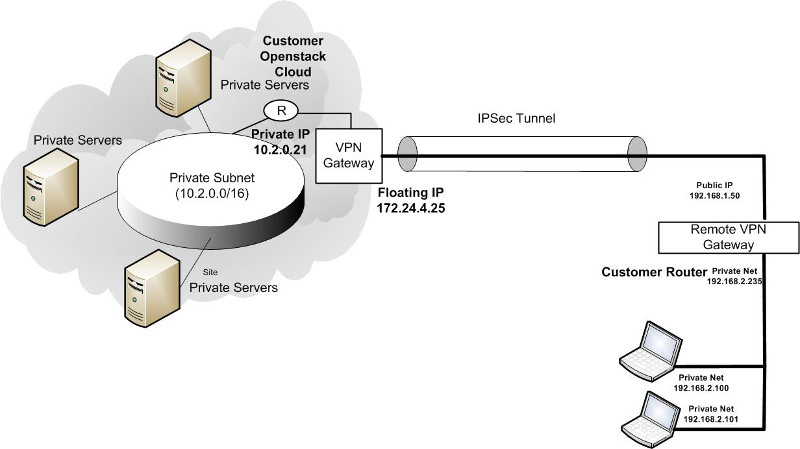

# HP Cloud Networking:  VPN setup quick start guide 

With HP Cloud Networking you can set up an IPsec, or site-to-site, VPN connecting your external network directly to your HP cloud virtual network. This guide provides the basic instructions for setting this up with your network using strongSwan. For more complex configuration, please refer to the [strongSwan documentation](http://wiki.strongswan.org/projects/strongswan/wiki/UserDocumentation).

This guide covers the following:

- [Overview](#top)
- [Audience](#audience)
- [Key terms](#terms)
- [Quick start](#quickstart)
- [Tips and best practices](#tips)
- [Troubleshooting](#troubleshooting)
- [For further information](#refs)

## Overview ## {#top}

HP Cloud Networking, based on OpenStack Networking, gives you a broad new spectrum of functionality to define and configure virtual networks.

A default network configuration comes with HP Cloud Compute Service activation. Your network is ready to deploy HP Cloud Compute virtual machines (instances) without further configuration required. The default configuration includes:

- A network   
- A subnet   
- A router connecting the subnet to the Internet   
- A security group with basic server options   

The guide provides instructions for creating an IPsec VPN (also known as a site-to-site VPN) from your external network directly into your HP Cloud virtual network.

**Note:** This guide uses strongSwan for the IPsec functionality.

A site-to-site VPN allows multiple fixed locations to establish secure connections with each other over a public network such as the Internet. Site-to-site VPN extends a defined network, making computer resources from one network available to other networks.

For VPN site-to-site connectivity, you will need to modify either the provided default network configuration or create your own network, subnet, router and ports using the OpenStack Networking API.  The customization can be done on either the command line or through the HP Cloud Services Management Console.  

Before starting, ensure that you have adequate permissions to accomplish each of the following steps.  

**Note:** VPN instances are a potential single point of failure. We will soon be posting a high availability VPN setup guide, so please stay tuned. 

### Audience ### {#audience}
This guide is designed for those in the following or similar roles:   

- Networking Engineers    
- Networking Administrators
* Cloud Administrators

To use this solution effectively, you should be familiar with   

- Local network configuration in HP Cloud     
- HP Cloud Compute and Networking services 
- OpenStack Nova and Neutron CLI and API   
- Virtual Private Networks (VPN)    
- strongSwan or other IPsec-based software solutions   
    

### Key Terms ### {#terms}

**IKE** - Internet Key Exchange

**IPsec** - Internet Protocol Security (IPsec) is a technology protocol suite for securing Internet Protocol (IP) communications by authenticating and/or encrypting each IP packet of a communication session. IPsec also includes protocols for establishing mutual authentication between agents at the beginning of the session and negotiation of cryptographic keys to be used during the session.

**NAT-T** - Network Address Translation - Traversal

**strongSwan** - strongSwan is an open source IPsec implementation for Linux 2.6 and 3.x kernels. The focus of the project is on strong authentication mechanisms using X.509 public key certificates and optional secure storage of private keys on smartcards through a standardized PKCS#11 interface.

back to the [top](#top)

## Quick start guide ## {#quickstart}

This guide provides the information you will need to get started in setting up a VPN that connects your local network to your Virtual Private Cloud (VPC) located in the HP Cloud.  In this guide, you create two instances--one as an example to use and the other as a gateway.

**NOTE:**  This guide assumes a "left" case with the "right" case being the hardware.  

We use strongSwan for this guide.  There are multiple ways to configure strongSwan and the instructions in this guide may not work for every environment.  Please refer to the [strongSwan user documentation](http://wiki.strongswan.org/projects/strongswan/wiki/UserDocumentation "strongSwan User Documentation") for advanced configuration information.

All commands in this guide use command line interfaces. 

The following steps walk you through the process:

- [Activate the compute service in HP Cloud](#compute)  
- [Set up the private network](#gtwy)
- [Create ports](#port)   
- [Create compute instances](#instances)
- [Associate floating IPs](#floatip)  
- [Enable uncomplicated firewall](#enableufw)
- [Install strongSwan](#installss)
- [Enable IP forwarding](#ipfrwrd)
- [Set up *ipsec.conf* on the gateway](#ipsec)
- [Set up Shared Secret](#secret)
- [Set up routes on non-gateway instance](#routes)
- [Establish connections](#connect)
- [Stop VPN connection](#stopconnect)

In this guide we use these parameters:

$EXT_NET = Ext-Net   
$CIDR = 10.2.0.0/24 (example range)   
$NETWORK_ID = the id of the created network   
$SUBNET_ID = the id of the created subnet   
$TENANT_ID = the id of the tenant   
$PORT_ID1 = id of port 1 (vm-gateway)     
$PORT_ID2 = id of port 2 (vm-test)    
$VM_GATEWAY = address of the VPN VM gateway (e.g., 10.2.0.21)   

For more details on the Nova and Neutron commands please see the [HP Cloud Networking](https://docs.hpcloud.com/api/v13/networking/) and [Compute](https://docs.hpcloud.com/api/v13/compute/) API specifications.

### Activate the compute service in HP Cloud ### {#compute}

If you have not previously created an account and activated the compute service please sign up at [http://hpcloud.com](http://hpcloud.com).  Once you activate the compute service, you need to install the [compute](https://docs.hpcloud.com/api/v13/compute/) and [networking](https://docs.hpcloud.com/api/v13/networking/) clients or the [CLI](http://docs.hpcloud.com/cli/unix/network). Make sure you activate a compute instance in HP Cloud version 13.5 to access the networking and VPN capabilities.

### Set up the private network ### {#gtwy}

#### Create the router and attach it to the external network   
**Note**: Skip this step if you are using the router provided with your service activation.

Create the router **vpn_router** and set its gateway to be the external network.

	neutron router-create vpn_router
	neutron router-gateway-set vpn_router $EXT_NET

#### Create a network and subnet
**Note**: Skip this step if you are using the network and subnet provided with your service activation.

In the example we use **vpn_network** for the name of the network.

    neutron net-create vpn_network
    neutron subnet-create $NETWORK_ID $CIDR 

#### Attach the router to the subnet  
**Note**: Skip this step if you are using the default configuration provided with your service activation.

    neutron router-interface-add vpn_router $SUBNET_ID  

### Create ports ### {#port}

Create two ports and disable the port security on the VPN gateway port.  

**NOTE:** disabling port security will disable the use of all security groups on the port.
	
    neutron port-create $NETWORK_ID --port_security_enabled False --name $PORT_ID1
    neutron port-create $NETWORK_ID --name $PORT_ID2

Ports can be viewed with **neutron port-list** command.

    neutron port-list 	
    +--------------------------------------+------+-------------------+-------------------------------------------------------------------------------------+
    | id                                   | name | mac_address       | fixed_ips                                                                           |
    +--------------------------------------+------+-------------------+-------------------------------------------------------------------------------------+
    | baf13412-2641-4183-9533-de8f5b91444c |      | fa:16:3e:f6:ec:c7 | {"subnet_id": "15a09f6c-87a5-4d14-b2cf-03d97cd4b456", "ip_address": "10.2.0.21"}  |
    | f7a08fe4-e79e-4b67-bbb8-a5002455a493 |      | fa:16:3e:97:e0:fc | {"subnet_id": "15a09f6c-87a5-4d14-b2cf-03d97cd4b456", "ip_address": "10.2.0.33"} |
    +--------------------------------------+------+-------------------+-------------------------------------------------------------------------------------+

### Create compute instances ### {#instances}
You need to create two instances (VMs) to test and run your VPN.

#### Create a keypair to allow ssh to the instance

    nova keypair-add ipsec_vpn_gateway > ipsec_vpn_gateway.pem
    chmod 600 ipsec_vpn_gateway.pem

The above command creates a new keypair called **ipsec_vpn_gateway**.  View all available keypairs with the **nova keypair-list** command.

    nova keypair-list
    +-------+--------------------------------------------------------------+
    |  Name              |                   Fingerprint                   |
    +--------------------+-------------------------------------------------+
    | ipsec_vpn_gateway  | b0:18:32:fa:4e:d4:3c:1b:c4:6c:dd:cb:53:29:13:82 |
    | mykey2             | b0:18:32:fa:4e:d4:3c:1b:c4:6c:dd:cb:53:29:13:82 |
    +--------------------+-------------------------------------------------+

#### Select your compute image

To boot a compute instance you will need to know which [operating system and size of image](https://docs.hpcloud.com/api/v13/compute/) you would like to use.  For the purpose of this guide, we use a small image. Select the type of image you want and then assess the amount of bandwidth you need and select the appropriately sized flavor.

#### Boot the gateway instance and test instance

Boot two instances--one to use as the VPN gateway (vm-gateway) and the other (vm-test) to test with.

- --image:  the name or ID of the image to launch.  View available images by running **nova image-list**
 
- --key_name:  the name of the key to inject into the instance at launch
- --flavor:  the name or ID of the size of the instance to create.  View the list of available flavors by running `nova flavor-list`.

Example: 
  
    nova boot --image <image-name> --flavor=100 --key_name=<keypair-name> --security-groups=<security-group-name> --nic port-id=<portid-1> <name of vm>

Example:  Create the gateway instance 

    nova boot --image small --flavor=100 --keyname=ipsec_vpn_gateway --nic port-id=$PORT_ID1 vm-gateway

Example:  Create the test instance   

    nova boot --image small --flavor=100 --keyname=ipsec_vpn_gateway --nic port-id=$PORT_ID2 vm-test

#### Validate status of instances

Check the status of the launched instance(s):   
  
    nova list
    +--------------------------------------+------------+--------+-----------------+
    | ID                                   | Name       | Status | Networks        |
    +--------------------------------------+------------|--------+-----------------+
    | 558159d5-1257-43db-b261-523207c8a290 | vm-gateway | ACTIVE | mynet=10.2.0.21 |
    | 8c0dbcaa-8ef7-484f-8f89-47760fdcd44a | vm-test    | ACTIVE | mynet=10.2.0.33 |
    +--------------------------------------+------------+--------+-----------------+

After a short period of time the instance changes from BUILD to ACTIVE.  You can then connect to the launched instance using the private key that you created.

### Associate floating IPs ### {#floatip}

#### Create the floating IPs

Next, you need to create the floating IPs associated with the external network (Ext_Net).  Each created floating IP has an ID that we will refer to as `$FLOATING_ID1` and `$FLOATING_ID2`.

    neutron floatingip-create $EXT_NET
    neutron floatingip-create $EXT_NET

#### Associated each floating IP with  a port

    neutron floatingip-associate $FLOATING_ID1 $PORT_ID1
    neutron floatingip-associate $FLOATING_ID2 $PORT_ID2

To show the floating IP: 
  
    neutron floatingip-show $FLOATING_ID1
    neutron floatingip-show $FLOATING_ID2

**Note:** You can also assign floating IPs via the Nova API and subsequently call the command `nova list` to display the instances and their status.

### Enable uncomplicated firewall ### {#enableufw}

We recommend that you use the [uncomplicated firewall (UFW](https://help.ubuntu.com/community/UFW) capability included in Ubuntu.

To enable the UFW:

	sudo ufw allow 22/tcp
	sudo ufw allow 500/udp
	sudo ufw allow 1293/tcp
	sudo ufw allow 4500/udp
	sudo ufw enable
	
	# After the last command, a prompt appears stating that this command "may disrupt existing ssh connections. Proceed with operation (y|n)?"
	# Answer "y" and ENTER to complete the procedure.

### Install strongSwan on the gateway instance ### {#installss}

strongSwan is a complete IPsec implementation for the Linux 2.6 and 3.x kernels.  The  Ubuntu distribution includes the strongSwan package. 

1. Log in to your gateway instance
2. `prompt> sudo apt-get install -y strongswan`
3. Install all dependencies including the kernel modules

You can find additional information on installing strongSwan on the strongSwan wiki:  [strongSwan Installation Documentation](http://wiki.strongswan.org/projects/strongswan/wiki/InstallationDocumentation "strongSwan wiki")

### Enable IP forwarding on the gateway instance ### {#ipfrwrd}

By default, Linux distributions have IP forwarding disabled. To act as a VPN gateway, you need to enable IP forwarding.  

**NOTE:** The *sysctl* kernel parameter change should be made permanently.

In the same instance where you installed strongSwan:   
1.  Edit the **/etc/sysctl.conf** file    
2.  Uncomment the line `net.ipv4.ip_forward=1` or set to `net.ipv4.ip_forward=1`   
3.  Save the file and exit   
4.  To enable the changes run the command: **sysctl -p /etc/sysctl.conf** 

Once you complete the above steps, verify that IP forwarding is enabled by running the command **sysctl net.ipv4.ip_forward**.

Example:  
    
    prompt> sysctl net.ipv4.ip_forward
    net.ipv4.ip_forward = 1   

### Set up ipsec.conf on the gateway instance ### {#ipsec}

strongSwan always considers itself as "LEFT" and the other side of the network (the remote server) with the hardware router as the "RIGHT".  When configuring the gateway instance consider it the "LEFT" node and the remote server as the "RIGHT" node.

Below is an example strongSwan *ipsec.conf* file.  Note that the information that is added to this file for detailing the left and right cases must be entered as created into both this file and the *ipsec.secrets* file.

For more details on setting up the *ipsec.conf* file, see the [strongSwan ipsec.conf](http://wiki.strongswan.org/projects/strongswan/wiki/IpsecConf) wiki page.

**Note:** the location of the *ipsec.conf* file is */etc/ipsec.conf*

	# ipsec.conf - strongSwan IPsec configuration file
	
	# basic configuration
	
	config setup
		plutodebug=all
		plutostderrlog=/home/ubuntu/plutolog.txt
		#crlcheckinterval=600
		# strictcrlpolicy=yes
		# cachecrls=yes
		nat_traversal=yes
		charonstart=no
		plutostart=yes
	
	# Add connections here.
	
	# Sample VPN connections
	
	conn %default 
	      ike=aes128-sha1-modp1024!
	      ikelifetime=28800s
	      keyexchange=ikev1
	      keyingtries=10
	      esp=aes128-sha1-modp1024!
	      keylife=3600s
	      rekeymargin=5m
	      type=tunnel
	      pfs=yes
	      compress=no
	      authby=secret
	conn vpn-test 
	      left=%defaultroute
	      leftid=10.2.0.21
	      leftsubnet=10.2.0.0/24
	      leftfirewall=yes
	      right=192.168.1.50
	      rightid=192.168.1.50
	      rightsubnet=192.168.2.0/24
	      dpdaction=hold
	      dpddelay=60
	      dpdtimeout=500 
	      auto=add
   
 
### Set up ipsec.secrets file on the gateway instance ### {#secret}

Modify the *ipsec.secrets* file for the basic site-to-site VPN setup.

strongSwan's *ipsec.secrets* file contains an unlimited number of the following types of secrets:

- RSA defines an RSA private key
- ECDSA defines an ECDSA private key
- PSK defines a pre-shared key
- EAP defines EAP credentials
- XAUTH defines XAUTH credentials
- PIN defines a smartcard PIN

For more details on modifying the *ipsec.secrets* file, see the [strongSwan ipsec.secrets](http://wiki.strongswan.org/projects/strongswan/wiki/IpsecSecrets) wiki page.

**Note**: The location of the *ipsec.secrets* file is */etc/ipsec.secrets*.

Based upon the authentication type and shared secret for the VPN instance customize the *ipsec.secrets* file with information from the above steps.

    # This file holds shared secrets or RSA private keys for inter-Pluto
    # authentication.  See ipsec_pluto(8) manpage, and HTML documentation.
	
    # RSA private key for this host, authenticating it to any other host
    # which knows the public part.  Suitable public keys, for ipsec.conf, DNS,
    # or configuration of other implementations, can be extracted conveniently
    # with "ipsec showhostkey".
	
    # this file is managed with debconf and will contain the automatically created private key
    # include /var/lib/strongswan/ipsec.secrets.inc 
    10.2.0.21 192.168.1.50 192.168.1.50 : PSK "abcd" 

### Set up routes on non-gateway instance ### {#routes}

On the non-VPN instance (vm-test) add the new route for the remote subnet.

Example: `route add -net <remote-subnet> gw <host gateway>`

    route add -net 192.168.2.0/24 gw 10.2.0.21

Verify that the new route was added by running the command **route-n** and finding the entry that was added in the table.

### Establish connections ### {#connect}

Force IPsec to read the updated *ipsec.conf* and *ipsec.secrets* files and to establish a connection:

    ipsec restart

Start the connection (conn) that is defined in *ipsec.conf*:

    ipsec up vpn-test

Validate that the IPsec processes are available by running the  command **ps -welf | grep ipsec**

### Stop the VPN connection ### {#stopconnect}

Force IPsec to read the updated *ipsec.conf* and 

Stop the connection (conn) that is defined in *ipsec.conf*:

    ipsec down vpn-test

**Note:** The above step is required for a safe restart. 

back to the [top](#top)

## Tips and best practices ## {#tips}

This portion of the document contains a collection of tips and best practices to help you to quickly setup your VPN configuration.

* If you need to allow multiple subnets through the VPN, you need to create another connection in the strongSwan *ipsec.conf* file.  
* Connect additional VPCs by adding additional IPsec configuration and secret files in */etc/ipsec.d*

back to the [top](#top)

## Troubleshooting ## {#troubleshooting}

These topics can help you address problems that might occur when you are setting up and configuring your VPN solution.	

1.  Confirm that strongSwan is running (IPsec process).  Verify that the IPsec processes are executing in the VPN instance.  If the below processes are not running restart the processes by following the steps found in the **Establish connections** section.
    
	* 	Run the command **ps -welf | grep ipsec**	
	* 	Verify that the below three processes are running:
		* 	IPsec starter process (/usr/lib/ipsec/starter)
		* 	IPsec Pluto process (/usr/lib/ipsec/pluto --nofork --uniqueids)
		* 	IPsec Charon process (usr/lib/ipsec/charon --use-syslog

2. If the */etc/auth.log* file exists, check for errors.

3. If able to connect the gateway VMs, but not go any further, validate that `port_security_enabled` is set to False (See [Create ports](#port)).

4.  If unable to ping the VMs behind the VPN ensure that you have set up the necessary routes on the non-gateway VM (See [Set up routes on non-gateway instance](#routes)).

back to the [top](#top)

## For further information ## {#refs}

- [UNIX CLI Network Examples](http://docs.hpcloud.com/cli/unix/network)
- [HP Cloud Networking API Specifications](https://docs.hpcloud.com/api/v13/networking/)
- [HP Cloud Compute Service API Reference](https://docs.hpcloud.com/api/v13/compute/)
- [strongSwan wiki FAQ](http://wiki.strongswan.org/projects/strongswan/wiki/FAQ)
- [strongSwan User Documentation](http://wiki.strongswan.org/projects/strongswan/wiki/UserDocumentation "strongSwan User Documentation")
- [strongSwan ipsec.conf reference](http://wiki.strongswan.org/projects/strongswan/wiki/IpsecConf)
- [strongSwan ipsec.secrets reference](http://wiki.strongswan.org/projects/strongswan/wiki/IpsecSecrets)
- [strongSwan ipsec.conf: conn <name> reference](http://wiki.strongswan.org/projects/strongswan/wiki/ConnSection)
- [strongSwan net2net-psk/ reference](http://www.strongswan.org/uml/testresults/ikev2/net2net-psk/)

back to the [top](#top)
